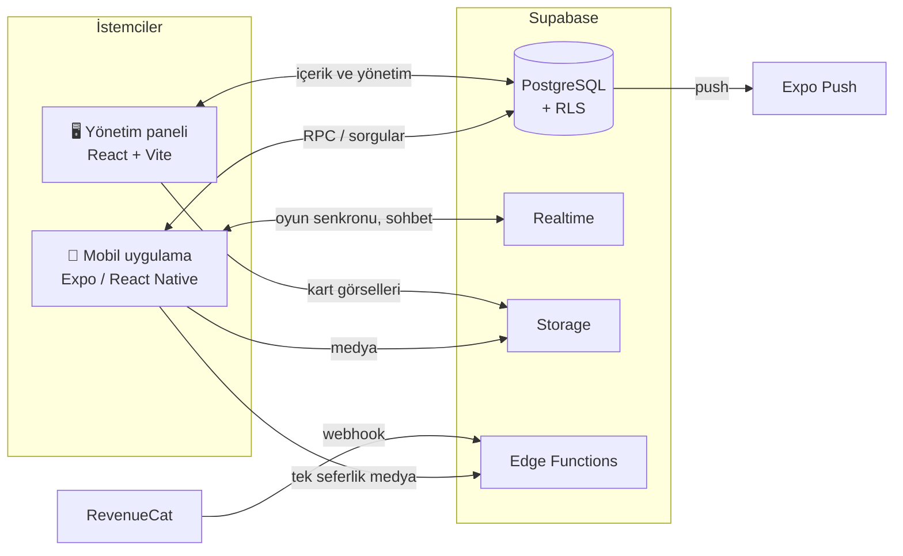

<div align="center">

# noc*ta*

**Çiftler için gece oyunları, sohbet ve anılar — yalnızca ikinize ait bir oda.**

18+ · iOS & Android · Türkçe

</div>

---

## Nocta nedir?

Nocta, yetişkin çiftlerin birbirini daha iyi tanıması, birlikte eğlenmesi ve bağını güçlendirmesi için tasarlanmış bir mobil uygulamadır. İki partner davet koduyla eşleşir, kendi seviyelerini seçer ve iki ayrı telefondan **gerçek zamanlı** olarak aynı oyunu oynar.

İçerik (oyunlar, kategoriler, sorular, testler, hikâyeler) web tabanlı bir yönetim panelinden yönetilir ve **mağaza güncellemesi gerektirmeden** uygulamaya anında yansır.

## Öne çıkan özellikler

### 🎲 13 farklı oyun
| Oyun | Nasıl oynanır |
|---|---|
| Doğruluk mu Cesaret mi | Sırayla kart çekilir, seviyeye göre ayarlanır |
| Hangisini Seçerdin / Bu mu Şu mu | İki seçenek, gizli seçim, eşleşme kontrolü |
| Beni Ne Kadar Tanıyorsun | Biri kendini anlatır, diğeri tahmin eder |
| Gizli Sorular | Cevaplar gizli yazılır, aynı anda açılır |
| Çift Görevleri | Zamanlı ve zamansız görevler |
| Çift Testleri | 4 seçenekli uyum ve bilgi testleri |
| Emojilerle Anlat | Emoji şıklar, animasyonlu doğru/yanlış efektleri |
| Kart Seç | Resimli kartlar, dönme efektiyle açılış |
| Çift Hikâyesi | Birlikte seçim yapılan dallanan hikâyeler |
| Sohbet Oyunu | Sohbet içinden görev gönderme |
| Rus Ruleti | İmzalı dürüstlük sözleşmesi, tamburda tek mermi; kime patlarsa itiraf eder |
| Shot Ruleti | 16 kadehli tepsi ve rulet; 4 sayılık aralık seç, tutmazsa partner içer |

Tüm oyunlarda cevaplar **iki taraf da cevaplamadan görünmez**, ardından 3-2-1 geri sayımıyla birlikte açılır.

### 💞 Çift deneyimi
- Davet kodu / QR ile eşleşme, çift odası
- **Çift rıza seviyesi:** iki partnerin seçtiği seviyenin düşük olanı geçerli olur
- Flört seviyesi (XP), günlük görev ve seri, rozetler, anı zaman çizelgesi
- Partner oyun başlattığında sesli "çağrı" bildirimi

### 🔒 Gizlilik
- Tek seferlik (bir kez açılan) fotoğraf ve video
- Sohbet ekranında ekran görüntüsü engeli ve alındığında karşı tarafa bildirim
- Kaybolan mesajlar, bildirim önizlemesini gizleme, biyometrik uygulama kilidi
- Sohbeti, anıları veya hesabı tek dokunuşla silme

### 🛠️ Yönetim paneli
Genel bakış ve analitik, kullanıcı/çift yönetimi, sınırsız kategori ve soru (toplu içe/dışa aktarma), test ve kart editörleri (görsel yükleme), dallanan hikâye editörü, raporlar, abonelikler, ödemeler, tanıtım kampanyası takibi ve rol tabanlı yetkilendirme.

## Teknolojiler

| Katman | Teknoloji |
|---|---|
| Mobil | React Native · **Expo SDK 57** · Expo Router · TypeScript · Reanimated · expo-video / image / notifications / screen-capture |
| Yönetim paneli | **React 18** · Vite · TypeScript · React Router |
| Arka uç | **Supabase** — PostgreSQL, Row Level Security, Realtime, Storage, Edge Functions (Deno) |
| Ödeme | RevenueCat (webhook ile abonelik senkronizasyonu) |
| Dağıtım | EAS Build / Submit (mağazalar), statik barındırma (panel) |

## Mimari



- **Oyun senkronizasyonu:** oturum durumu veritabanında tutulur; iki cihaz Realtime ile anlık güncellenir.
- **Gizli cevaplar sunucuda korunur:** partnerin cevabı, siz cevaplamadan veritabanı kuralları gereği size gönderilmez.
- **İçerik güncellemeleri:** içerik değiştiğinde sürüm numarası artar, uygulama yeni içeriği indirip cihazda önbelleğe alır.

## Proje yapısı

```
mobile/     Mobil uygulama (Expo)
  src/app/          Ekranlar (dosya tabanlı yönlendirme)
  src/components/   Arayüz bileşenleri ve oyun motorları
  src/lib/          Supabase istemcisi, bildirimler, medya, yardımcılar
  src/providers/    Oturum, içerik ve bildirim durumları
admin/      Yönetim paneli (React + Vite)
supabase/   Veritabanı şeması (migrations), başlangıç içeriği (seed), edge fonksiyonları
design/     Arayüz tasarım dosyaları
docs/       Kurulum ve geliştirme rehberi
```

## Güvenlik yaklaşımı

- Tüm tablolarda **satır düzeyi güvenlik (RLS)**; kullanıcılar yalnızca kendi ve partnerlerinin verisine erişir.
- Yönetici işlemleri rol kontrollü sunucu fonksiyonlarıyla yapılır.
- Uygulama yalnızca herkese açık (publishable) anahtarı kullanır; yetkili anahtarlar yalnızca sunucu tarafındaki fonksiyonlarda bulunur.
- Bağlantı bilgileri depoya eklenmez, yerel `.env` dosyalarında tutulur.
- 18 yaş sınırı veritabanı seviyesinde uygulanır.


---

<div align="center">
© 2026 Nocta · Tüm hakları saklıdır.
</div>
